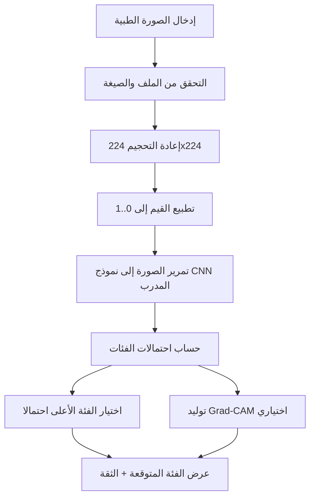
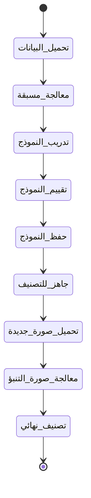

# 1. عنوان المشروع

## نظام ذكي لاكتشاف سرطانات الكبد من الصور الطبية باستخدام الشبكات العصبية الالتفافية (CNN)

يهدف هذا المشروع إلى بناء نموذج تعلم عميق قادر على تصنيف صور الكبد الطبية إلى فئات مرضية وسليمة اعتمادًا على الصور المخزنة محليًا.  
تم تطوير النظام باستخدام TensorFlow/Keras مع واجهة تفاعلية للتدريب والعرض والتنبؤ بصورة مريض جديدة.

---

# 2. فكرة المشروع

يركز المشروع على أتمتة جزء من عملية التشخيص الأولي عبر تحليل الصور الطبية للكبد باستخدام التعلم العميق. الفكرة الأساسية هي تدريب نموذج CNN على مجموعة صور منظّمة بحسب الفئات المرضية، ثم استخدام النموذج المتعلم لتوقع فئة الصورة الجديدة مع درجة ثقة.

تم اختيار CNN لأنها الأنسب لمعالجة الصور واستخراج الخصائص المكانية الدقيقة تلقائيًا مثل الحواف والأنماط النسيجية، دون الحاجة إلى هندسة ميزات يدوية معقدة.

تكمن أهمية المشروع طبيًا في:

- دعم القرار السريري بمؤشر احتمالي مبكر.
- تقليل العبء التشخيصي في الحالات ذات الحجم الكبير من الصور.
- توفير أداة قابلة للتطوير لاحقًا في بيئات بحثية أو تعليمية متقدمة.

---

# 3. هيكل المشروع

البنية الحالية للمشروع:

```text
cnn_liver/
├─ Liver_Dataset/
│  ├─ Angiosarcoma/
│  ├─ Cholangiocarcinoma/
│  ├─ Healthy/
│  ├─ Hemangioma/
│  └─ Hepatocellular_Carcinoma/
├─ train_liver_cnn.py
├─ predict_single.py
├─ app.py
├─ requirements.txt
└─ README.md
```

توضيح الملفات الأساسية:

- train_liver_cnn.py: مسار التدريب الكامل، التقييم، الحفظ، وGrad-CAM.
- predict_single.py: التنبؤ بصورة مفردة باستخدام نموذج مدرب مسبقًا.
- app.py: واجهة Streamlit للتدريب وعرض النتائج ورفع صورة مريض جديدة.
- requirements.txt: الاعتماديات البرمجية اللازمة للتشغيل.
- Liver_Dataset: مجلد البيانات المحلي، وكل مجلد فرعي يمثل فئة تصنيف.

---

# 4. شرح الداتا سيت

يعتمد المشروع على بيانات صور طبية موجودة محليًا داخل المجلد Liver_Dataset، بحيث لا يتم تنزيل بيانات من الإنترنت أثناء التشغيل.

تنظيم البيانات يكون بنمط التصنيف المعياري (Folder-per-Class):

- كل مجلد فرعي يمثل فئة مستقلة.
- اسم المجلد هو اسم الفئة المستخدمة في التدريب والتنبؤ.

الفئات المستنتجة من البنية الحالية:

- Angiosarcoma
- Cholangiocarcinoma
- Healthy
- Hemangioma
- Hepatocellular_Carcinoma

عدد الفئات الحالي: 5 فئات.

طريقة التحميل في الكود:

- يتم استخدام image_dataset_from_directory من Keras.
- يتم تقسيم البيانات تلقائيًا إلى تدريب/تحقق عبر validation_split.
- يتم تحديد نوع الوسوم تلقائيًا:
  - binary عند وجود فئتين.
  - categorical عند وجود 3 فئات أو أكثر.

---

# 5. المعالجة المسبقة (Preprocessing)

تتضمن خط المعالجة في المشروع الخطوات التالية:

1. إعادة التحجيم إلى 224x224:
  - توحيد أبعاد الإدخال للنموذج.
  - تسهيل المعالجة على دفعات ثابتة.

2. التطبيع Normalization إلى المجال [0, 1]:
  - عبر قسمة قيم البكسل على 255.
  - يساعد في استقرار التدريب وتسريع التقارب.

3. زيادة البيانات Data Augmentation أثناء التدريب:
  - RandomRotation
  - RandomZoom
  - RandomFlip (أفقي)

الهدف من الزيادة البيانية هو تحسين التعميم وتقليل فرط التخصيص عبر تعريض النموذج لتباينات بصرية متعددة لنفس الفئة.

---

# 6. تصميم النموذج (CNN Architecture)

يعتمد النموذج على بنية CNN تدريجية لاستخراج الخصائص من المستوى المنخفض إلى المستوى العالي:

1. طبقات Conv2D + ReLU:
  - استخراج الأنماط البصرية الأساسية (حواف، قوام، تراكيب).
  - زيادة عدد المرشحات تدريجيًا (مثل 32 ثم 64 ثم 128 ثم 256).

2. طبقات MaxPooling2D:
  - تقليل الأبعاد المكانية للميزات.
  - الحفاظ على المعلومات الأهم وخفض كلفة الحساب.

3. طبقات Dropout:
  - تقليل الاعتماد المفرط على مسارات تنشيط محددة.
  - دعم التعميم والحد من overfitting.

4. Flatten ثم Dense:
  - تحويل خرائط الميزات إلى متجه.
  - طبقة Dense تتعلم العلاقات غير الخطية عالية المستوى.

5. طبقة الإخراج:
  - Sigmoid مع وحدة واحدة عند التصنيف الثنائي.
  - Softmax بعدد فئات البيانات عند التصنيف متعدد الفئات.

---

# 7. التدريب (Training Process)

خطوات التدريب المعتمدة:

1. تقسيم البيانات:
  - 80% تدريب.
  - 20% تحقق Validation.

2. دالة الخسارة:
  - binary_crossentropy للتصنيف الثنائي.
  - categorical_crossentropy للتصنيف متعدد الفئات.

3. المحسن Optimizer:
  - Adam.

4. عدد الدورات Epochs:
  - قابل للضبط من سطر الأوامر أو من الواجهة.

5. الإيقاف المبكر Early Stopping:
  - يعتمد على val_loss مع استرجاع أفضل أوزان.

6. حفظ النموذج:
  - حفظ رئيسي إلى liver_cancer_model.h5.
  - حفظ أفضل نموذج أثناء التدريب إلى outputs/best_model.keras.
  - في حال تعذر حفظ h5، يتم حفظ نسخة بديلة إلى outputs/final_model.keras.

---

# 8. التصنيف (Prediction / Inference)

آلية التنبؤ بصورة جديدة:

1. تحميل الصورة من المسار المدخل.
2. إعادة التحجيم إلى 224x224.
3. التطبيع إلى [0, 1].
4. تمرير الصورة إلى النموذج المدرب.
5. استخراج الفئة ذات الاحتمال الأعلى مع قيمة الثقة.

تفسير المخرجات:

- predicted_class: اسم الفئة المتوقعة.
- confidence: ثقة النموذج في الفئة المتوقعة.
- probabilities: احتمال كل فئة على حدة (في الواجهة).

في الواجهة، يتم أيضًا اشتقاق نسبة إصابة تقريبية إذا كانت فئة Healthy أو Normal موجودة.

---

# 9. نقل المشروع إلى جهاز آخر

لتشغيل المشروع على جهاز جديد:

1. نسخ مجلد المشروع كاملًا.
2. التأكد من وجود مجلد Liver_Dataset في نفس مستوى ملفات المشروع.
3. إنشاء بيئة بايثون افتراضية (مفضل).
4. تثبيت المتطلبات:

```bash
pip install -r requirements.txt
```

5. تشغيل التدريب أو التنبؤ أو الواجهة حسب الحاجة.

مشاكل محتملة وحلولها:

- المشكلة: الأمر streamlit غير معروف.
  - الحل: التشغيل عبر بايثون مباشرة:

```bash
python -m streamlit run app.py
```

- المشكلة: فشل حفظ النموذج بصيغة h5.
  - الحل: تم تضمين حفظ بديل تلقائي إلى final_model.keras داخل outputs.

- المشكلة: عدم ظهور قسم التنبؤ في الواجهة بعد التدريب.
  - الحل: التأكد من وجود ملف نموذج واحد على الأقل (h5 أو best_model.keras أو final_model.keras) ووجود class_names.json أو مجلد البيانات الأصلي.

---

# 10. مخططات توضيحية (IMPORTANT)

## Flowchart



## State Diagram



---

# 11. النتائج والتقييم

يعرض المشروع مخرجات تقييم معيارية بعد كل تدريب، وتشمل:

- Accuracy للتدريب والتحقق.
- Loss للتدريب والتحقق.
- Classification Report (Precision, Recall, F1-score) لكل فئة.
- Confusion Matrix لتفسير الأخطاء بين الفئات.

التفسير العلمي المختصر:

- ارتفاع accuracy مع انخفاض loss مؤشر جيد على التعلم.
- فجوة كبيرة بين train وvalidation قد تشير إلى overfitting.
- مصفوفة الالتباس تساعد في معرفة الفئات الأكثر تداخلا، ما يفيد في تحسين البيانات أو البنية لاحقًا.

---

# 12. تحسينات مستقبلية

لرفع الأداء البحثي والتطبيقي للمشروع يمكن اعتماد ما يلي:

1. استخدام Transfer Learning:
  - مثل ResNet50 أو EfficientNet مع Fine-tuning.

2. توسيع البيانات:
  - زيادة عدد الصور وتوازن الفئات.
  - تحسين جودة البيانات وتعليقاتها الطبية.

3. تحسين المعمارية والإعدادات:
  - ضبط hyperparameters بشكل منهجي.
  - تجربة استراتيجيات تنظيم إضافية وجدولة معدل التعلم.

4. تحسين التقييم السريري:
  - إضافة مقاييس مثل AUC-ROC وSensitivity وSpecificity عند الحاجة الطبية.

---

# 13. طريقة التشغيل

## أولا: تثبيت المتطلبات

```bash
pip install -r requirements.txt
```

## ثانيا: تدريب النموذج

```bash
python train_liver_cnn.py --data-dir Liver_Dataset --epochs 30
```

مثال تدريب مخصص:

```bash
python train_liver_cnn.py --data-dir Liver_Dataset --epochs 15 --batch-size 16 --patience 5 --output-dir outputs --model-path liver_cancer_model.h5
```

## ثالثا: التنبؤ بصورة مفردة عبر سطر الأوامر

```bash
python predict_single.py --image-path "path/to/image.jpg"
```

## رابعا: تشغيل الواجهة التفاعلية

```bash
python -m streamlit run app.py
```

بعد فتح الواجهة:

1. اضبط إعدادات التدريب واضغط زر بدء التدريب.
2. راقب السجل وشريط تقدم Epoch أثناء التدريب.
3. استعرض المخططات والتقرير بعد انتهاء التدريب.
4. ارفع صورة مريض جديدة في قسم التشخيص للحصول على النتيجة والاحتمالات.

---

## ملاحظة أكاديمية ختامية

هذا المشروع مناسب كنواة قوية لمشروع تخرج في مرحلة البكالوريوس، لأنه يجمع بين بناء نموذج تعلم عميق، التقييم الإحصائي، التفسير البصري (Grad-CAM)، والتكامل مع واجهة استخدام تطبيقية. ويمكن تطويره لاحقًا إلى إطار بحثي سريري أوسع بعد التحقق على بيانات أكبر وأكثر تنوعًا.
