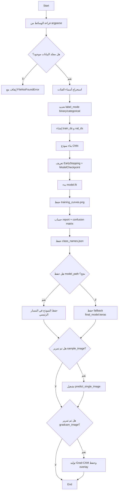
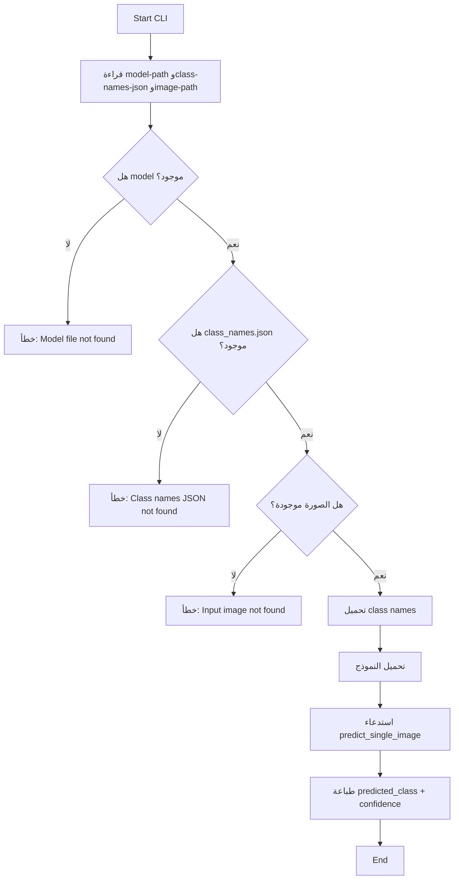
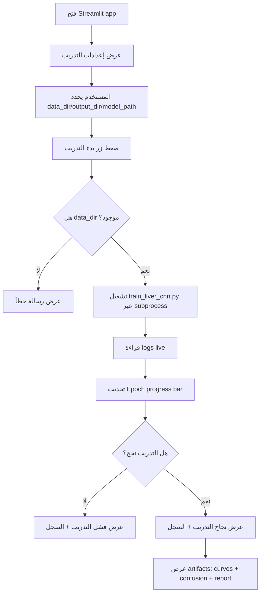
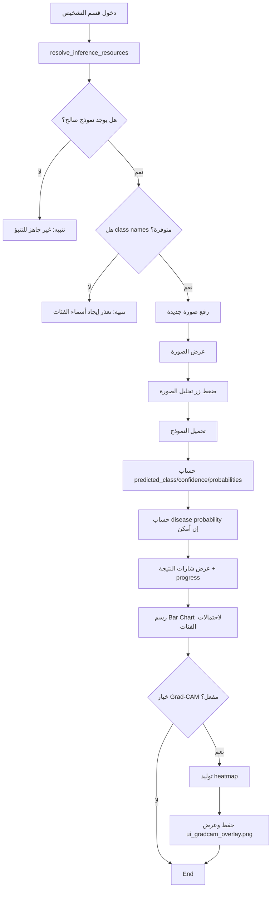
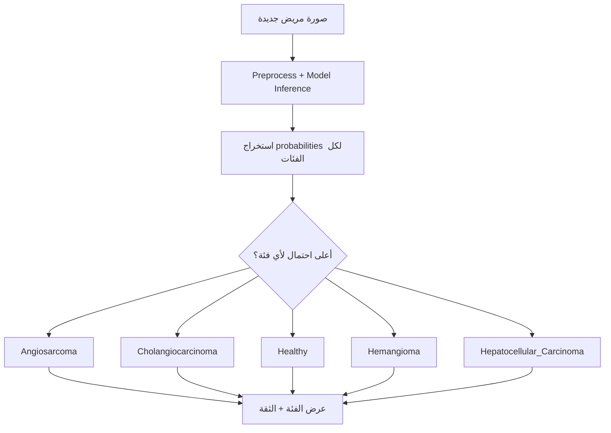

# نظام ذكي لتصنيف صور الكبد الطبية باستخدام CNN + Streamlit

هذا المشروع يقدّم نظامًا متكاملًا لتدريب نموذج تعلم عميق على صور الكبد، ثم استخدامه للتنبؤ بحالة صورة مريض جديدة عبر سطر الأوامر أو عبر واجهة Streamlit تفاعلية.

الهدف من المشروع:
- بناء خط عمل واضح يبدأ من البيانات الخام وينتهي بنتيجة تشخيص احتمالية.
- عرض نتائج التدريب بشكل بصري (منحنيات، مصفوفة التباس، تقرير تصنيف).
- دعم التفسير البصري عبر Grad-CAM لإظهار مناطق التأثير في الصورة.

> تنبيه طبي: هذا المشروع تعليمي/بحثي ولا يقدّم تشخيصًا طبيًا نهائيًا.

---

## 0) ما هي CNN؟ ولماذا استخدمناها هنا؟

CNN اختصار لـ Convolutional Neural Network، وهي شبكة عصبية متخصصة في فهم الصور.

الفكرة الأساسية:
1. طبقات الالتفاف Convolution تتعلم Features تلقائيًا (حواف، قوام، أنماط نسيجية دقيقة).
2. طبقات التجميع Pooling تقلل الأبعاد وتحافظ على المعلومات الأهم.
3. طبقات Fully Connected تتخذ القرار النهائي للفئة.

لماذا CNN مناسبة لصور الكبد؟
- الصور الطبية غالبًا تحتوي تفاصيل نسيجية صغيرة لا يمكن تمثيلها بسهولة بقواعد يدوية.
- CNN تتعلم هذه التفاصيل مباشرة من البيانات.
- تعطي أداء قوي في مهام التصنيف الصوري مقارنة بطرق تقليدية كثيرة.

كيف طُبقت داخل هذا المشروع؟
- Data Augmentation لتحسين التعميم.
- Conv2D + MaxPooling + Dropout على مراحل.
- مخرج Softmax متعدد الفئات (أو Sigmoid عند حالتين فقط).
- تدريب مع Early Stopping وModelCheckpoint لضبط الجودة.

---

## 0.1) التقنيات المستخدمة في المشروع

### تقنيات الذكاء الاصطناعي والتعلم العميق
- TensorFlow / Keras: بناء وتدريب النموذج.
- CNN Architecture: التصنيف الصوري الطبي.
- Data Augmentation: Rotation/Zoom/Flip.
- Early Stopping: إيقاف ذكي عند توقف التحسن.
- Model Checkpointing: حفظ أفضل نموذج تلقائيًا.
- Grad-CAM: تفسير بصري لقرار النموذج.

### تقنيات التحليل والتقييم
- Scikit-learn:
  1. Classification Report
  2. Confusion Matrix
- Matplotlib + Seaborn: رسم المنحنيات والمخططات.

### تقنيات التطبيق والواجهة
- Streamlit: واجهة ويب تفاعلية للتدريب والتشخيص.
- PIL (Pillow): تحميل ومعالجة الصور.
- NumPy: المعالجة العددية للمصفوفات.

### تقنيات البنية والتشغيل
- argparse: استقبال إعدادات التشغيل من الطرفية.
- pathlib + json: إدارة المسارات وتخزين أسماء الفئات.
- subprocess: تشغيل التدريب من داخل واجهة Streamlit مع عرض Live logs.

---

## 1) محتوى المشروع (ما الذي يوجد في كل ملف؟)

```text
cnn_liver/
├─ Liver_Dataset/
│  ├─ Angiosarcoma/
│  ├─ Cholangiocarcinoma/
│  ├─ Healthy/
│  ├─ Hemangioma/
│  └─ Hepatocellular_Carcinoma/
├─ outputs/
│  └─ best_model.keras
├─ app.py
├─ predict_single.py
├─ train_liver_cnn.py
├─ requirements.txt
└─ README.md
```

شرح سريع:
- `train_liver_cnn.py`: التدريب الكامل، التقييم، حفظ الرسوم، حفظ النموذج، توليد Grad-CAM.
- `predict_single.py`: تحميل النموذج المدرب وإجراء تنبؤ لصورة واحدة من الطرفية.
- `app.py`: واجهة Streamlit لتشغيل التدريب وعرض النتائج وتشخيص صورة جديدة.
- `requirements.txt`: مكتبات المشروع.
- `Liver_Dataset/`: البيانات المحلية (كل مجلد فرعي = فئة).
- `outputs/`: نواتج التدريب (منحنيات، مصفوفة، تقرير، أسماء الفئات، نماذج محفوظة).

---

## 2) شرح الداتا سِت وآلية قراءتها

المشروع يعتمد على نمط "Folder-per-Class":
- كل فئة لها مجلد مستقل.
- اسم المجلد نفسه يُستخدم كاسم الفئة في التدريب والتوقع.

الفئات الموجودة حاليًا:
- Angiosarcoma
- Cholangiocarcinoma
- Healthy
- Hemangioma
- Hepatocellular_Carcinoma

تحميل البيانات يتم عبر:
- `keras.utils.image_dataset_from_directory`

النقاط المهمة في التحميل:
- تقسيم تلقائي Train/Validation عبر `validation_split=0.2`.
- `subset="training"` و `subset="validation"`.
- `label_mode` يختار تلقائيًا:
1. `binary` إذا عدد الفئات = 2
2. `categorical` إذا عدد الفئات >= 3

---

## 3) شرح تفصيلي لملف التدريب train_liver_cnn.py

هذا الملف هو قلب المشروع، وفيه كل مراحل التعلم.

### 3.1 دوال إدارة البيانات

- `get_class_names(data_dir)`:
  - تقرأ أسماء المجلدات الفرعية وتعيدها مرتبة.
  - ترمي خطأ إذا لم تجد فئات.

- `get_label_mode(num_classes)`:
  - تقرر هل المهمة binary أو categorical.

- `create_datasets(...)`:
  - تنشئ `train_ds` و `val_ds` من نفس المجلد.
  - تضبط حجم الصور إلى `img_size`.
  - تفعّل `prefetch(tf.data.AUTOTUNE)` لتحسين الأداء.

### 3.2 بناء نموذج CNN

الدالة: `build_model(input_shape, num_classes)`

مكوّنات النموذج:
1. Data Augmentation داخل النموذج:
   - `RandomRotation(0.1)`
   - `RandomZoom(0.1)`
   - `RandomFlip("horizontal")`
2. `Rescaling(1/255)` لتطبيع الصور.
3. كتل Convolution + MaxPooling + Dropout:
   - مرشحات: 32 -> 64 -> 128 -> 256
4. `Flatten` ثم `Dense(256)` ثم `Dropout(0.5)`.
5. خرج نهائي:
   - `sigmoid` لو فئتين.
   - `softmax` لو أكثر من فئتين.

اختيارات التدريب:
- Optimizer: `Adam`
- Loss:
1. `binary_crossentropy`
2. `categorical_crossentropy`
- Metric: `accuracy`

### 3.3 عملية التدريب الفعلية

داخل `train(args)`:
1. التحقق من وجود مجلد البيانات.
2. اكتشاف الفئات تلقائيًا.
3. إنشاء مجموعات التدريب والتحقق.
4. بناء النموذج.
5. تعريف callbacks:
   - `EarlyStopping` على `val_loss` مع `restore_best_weights=True`.
   - `ModelCheckpoint` لحفظ أفضل نموذج في `outputs/best_model.keras`.
6. تشغيل `model.fit(...)`.

### 3.4 التقييم وحفظ النتائج

بعد التدريب، السكربت يقوم بـ:

- `plot_training_curves(history, output_dir)`:
  - يحفظ رسم الدقة والخسارة في `outputs/training_curves.png`.

- `evaluate_model(model, val_ds, class_names, output_dir)`:
  - يتنبأ على مجموعة التحقق.
  - يبني `classification_report` ويحفظه نصيًا في `outputs/classification_report.txt`.
  - يبني `confusion_matrix` ويحفظها كصورة في `outputs/confusion_matrix.png`.

- حفظ أسماء الفئات في:
  - `outputs/class_names.json`

- حفظ النموذج النهائي:
1. يحاول إلى المسار المطلوب (افتراضيًا `liver_cancer_model.h5`)
2. إن فشل، يحفظ نسخة بديلة `outputs/final_model.keras`

### 3.5 التنبؤ المساعد وGrad-CAM داخل نفس الملف

يوجد دوال إضافية تُستخدم أيضًا من الواجهة:
- `preprocess_single_image(...)`
- `predict_single_image(...)`
- `predict_single_image_detailed(...)`
- `make_gradcam_heatmap(...)`
- `save_gradcam_overlay(...)`

هذه الدوال تجعل الملف ليس فقط للتدريب، بل أيضًا لإعادة الاستخدام في الاستدلال والشرح البصري.

---

## 4) شرح تفصيلي لملف التنبؤ predict_single.py

هذا سكربت بسيط لتشخيص صورة واحدة من الطرفية.

ماذا يفعل؟
1. يقرأ الوسائط:
   - `--model-path`
   - `--class-names-json`
   - `--image-path` (إلزامي)
   - `--img-size`
2. يتحقق أن الملفات موجودة فعلا.
3. يحمّل النموذج باستخدام `keras.models.load_model`.
4. يحمّل أسماء الفئات من `class_names.json`.
5. يستدعي `predict_single_image` من ملف التدريب.
6. يطبع النتيجة كقاموس: الفئة المتوقعة + الثقة.

متى نستخدمه؟
- عندما تريد تشخيص سريع بدون تشغيل واجهة Streamlit.

---

## 5) شرح تفصيلي لملف الواجهة app.py (Streamlit)

هذا الملف يحوّل المشروع إلى تطبيق تفاعلي واضح للمستخدم.

### 5.1 فلسفة تصميم الواجهة

الواجهة مبنية على 3 مراحل متسلسلة:
1. إعدادات التدريب
2. نتائج التدريب
3. تشخيص صورة جديدة

أي أن المستخدم لا يحتاج يتنقل بين سكربتات يدوية، كل شيء ضمن تدفق واحد.

### 5.2 التهيئة العامة

- `st.set_page_config(...)` لضبط العنوان والأيقونة وتخطيط Wide.
- `apply_custom_style()` يضيف CSS مخصص:
  - خطوط عربية جميلة.
  - خلفية متدرجة.
  - بطاقات ناعمة.
  - شارات عرض للنتائج.

### 5.3 إدارة موارد التنبؤ

الدالة `resolve_inference_resources(...)` تبحث تلقائيًا عن نموذج صالح بالترتيب:
1. `liver_cancer_model.h5` (المسار المفضل)
2. `outputs/best_model.keras`
3. `outputs/final_model.keras`

ثم تسترجع أسماء الفئات من:
1. `outputs/class_names.json`
2. أو من مجلد البيانات مباشرة إذا الملف غير موجود.

### 5.4 منطق نسبة الإصابة التقريبية

الدالة `compute_disease_probability(probabilities)` تعمل كالتالي:
- إذا وجدت فئة اسمها يحتوي Healthy أو Normal:
  - نسبة الإصابة = $1 - P(Healthy)$
- إذا التصنيف ثنائي بدون Healthy صريحة:
  - تستخدم احتمال الفئة الثانية بعد الترتيب.
- غير ذلك:
  - تعرض أنه لا يمكن اشتقاق نسبة إصابة آليًا.

### 5.5 تشغيل التدريب من داخل الواجهة

الدالة `run_training(...)`:
- تشغل سكربت التدريب عبر `subprocess.Popen`.
- تلتقط السجل live سطرًا بسطر.
- تستخرج تقدم Epoch عبر Regex: `Epoch x/y`.
- تحدّث:
  - مربع الحالة
  - شريط التقدم
  - صندوق السجل

### 5.6 عرض نواتج التدريب

الدالة `show_training_artifacts(output_dir)` تعرض:
- صورة منحنيات التدريب `training_curves.png`
- صورة مصفوفة الالتباس `confusion_matrix.png`
- نص تقرير التصنيف `classification_report.txt`

### 5.7 قسم تشخيص صورة جديدة

الدالة `show_prediction_section(...)` تنفذ:
1. رفع صورة (jpg/png).
2. عرض الصورة للمستخدم.
3. عند الضغط على "تحليل الصورة":
   - تحميل النموذج.
   - توقع شامل (فئة + ثقة + احتمالات كل الفئات).
   - عرض شريط نسبة الإصابة التقريبية عند الإمكان.
   - رسم مخطط أعمدة أفقي لاحتمالات الفئات.
   - خيار عرض Grad-CAM.

---

## 6) آلية التدريب بشكل علمي مبسّط

### 6.1 ما الذي يتعلمه النموذج؟

طبقات الالتفاف CNN تتعلم تلقائيًا سمات بصرية:
- حواف
- نسيج
- أنماط مرضية دقيقة

ومع كل epoch يتم تحديث الأوزان لتقليل دالة الخسارة.

### 6.2 لماذا Early Stopping مهم؟

لو استمر التدريب طويلًا قد يزيد overfitting.
لذلك عند توقف تحسن `val_loss` لعدد epochs محدد (`patience`)، يتم إيقاف التدريب مع استرجاع أفضل وزن.

### 6.3 كيف نعرف إن النتائج جيدة؟

نراجع معًا:
1. منحنيات التدريب والتحقق
2. تقرير التصنيف (Precision/Recall/F1)
3. مصفوفة الالتباس

إذا كانت دقة التدريب عالية ودقة التحقق منخفضة بشكل واضح، غالبًا يوجد overfitting.

---

## 7) آلية التوقع لصورة مريض جديدة

خطوات التوقع منطقيا:
1. قراءة الصورة.
2. إعادة تحجيم إلى `224x224`.
3. تحويل إلى مصفوفة Float.
4. تطبيع القيم إلى $[0,1]$.
5. إضافة بعد الدفعة Batch Dimension.
6. تمريرها إلى النموذج.
7. استخراج الاحتمالات.
8. اختيار الفئة ذات الاحتمال الأعلى.

المخرجات الأساسية:
- `predicted_class`
- `confidence`
- `probabilities` (في الواجهة)

---

## 8) شرح المخططات التي تظهر في الواجهة

### 8.1 Training Curves

الصورة تحتوي رسمين:
- Accuracy (Train/Val)
- Loss (Train/Val)

ماذا نقرأ منها؟
- تقارب train وval عادة جيد.
- تباعد كبير قد يعني overfitting أو مشكلة بيانات.

### 8.2 Confusion Matrix

توضح كم مرة النموذج خلط بين الفئات.

قراءة سريعة:
- القطر الرئيسي العالي = أداء جيد.
- خارج القطر = أخطاء تصنيف تحتاج تحليل.

### 8.3 Classification Report

يعرض لكل فئة:
- Precision
- Recall
- F1-score
- Support

هذا مهم لفهم الأداء لكل مرض على حدة وليس فقط Accuracy عامة.

### 8.4 مخطط احتمالات الفئات في التنبؤ

بعد رفع صورة مريض، يظهر Bar Chart أفقي:
- كل سطر = فئة
- طول العمود = احتمالها

يساعد الطبيب/الباحث يفهم هل النتيجة واثقة جدًا أو متقاربة بين فئات.

### 8.5 Grad-CAM

صورة حرارية فوق الصورة الأصلية تبين المناطق التي ركز عليها النموذج لاتخاذ القرار.

الفائدة:
- زيادة قابلية التفسير (Interpretability)
- اكتشاف سلوك غير منطقي للنموذج إذا ركز على مناطق غير مناسبة

---

## 9) كيفية تشغيل المشروع من الصفر (جهاز جديد)

## 9.1 المتطلبات الأساسية

- Python 3.10+ (يفضّل 3.10 أو 3.11)
- pip محدث
- وجود مجلد البيانات `Liver_Dataset` داخل نفس المشروع

## 9.2 إنشاء بيئة افتراضية (Windows PowerShell)

```powershell
python -m venv .venv
Set-ExecutionPolicy -Scope Process -ExecutionPolicy RemoteSigned
.\.venv\Scripts\Activate.ps1
python -m pip install --upgrade pip
pip install -r requirements.txt
```

## 9.3 إنشاء بيئة افتراضية (Windows CMD)

```bat
python -m venv .venv
.venv\Scripts\activate.bat
python -m pip install --upgrade pip
pip install -r requirements.txt
```

## 9.4 إنشاء بيئة افتراضية (Linux / macOS)

```bash
python3 -m venv .venv
source .venv/bin/activate
python -m pip install --upgrade pip
pip install -r requirements.txt
```

---

## 10) أوامر التشغيل العملية

### 10.1 تدريب النموذج

```bash
python train_liver_cnn.py --data-dir Liver_Dataset --epochs 30
```

مثال أكثر تخصيصًا:

```bash
python train_liver_cnn.py --data-dir Liver_Dataset --epochs 15 --batch-size 16 --patience 5 --output-dir outputs --model-path liver_cancer_model.h5
```

### 10.2 توقع لصورة واحدة من الطرفية

```bash
python predict_single.py --image-path "path/to/image.jpg"
```

### 10.3 تشغيل واجهة Streamlit

```bash
python -m streamlit run app.py
```

---

## 11) ما الذي سيُحفظ في outputs بعد التدريب؟

عادة ستجد:
- `best_model.keras`: أفضل وزن حسب `val_loss`.
- `training_curves.png`: منحنيات Accuracy/Loss.
- `confusion_matrix.png`: مصفوفة الالتباس.
- `classification_report.txt`: تقرير المقاييس.
- `class_names.json`: أسماء الفئات.
- `final_model.keras` (في حال تعذر حفظ المسار الرئيسي).

---

## 12) كيف صُممت الواجهة بـ Streamlit؟

تصميم الواجهة يعتمد على مبدأ "تدفق العمل الطبي":
1. أولًا إعداد التدريب.
2. ثم تقييم النتائج.
3. ثم تشخيص حالة جديدة.

تفاصيل تجربة المستخدم:
- Styling مخصص باستخدام CSS داخل Streamlit.
- تقسيم بصري واضح داخل Containers.
- Feedback فوري أثناء التدريب (logs + progress).
- قرارات قابلة للتفسير بعد التوقع (احتمالات + Grad-CAM).

بالتالي الواجهة ليست مجرد زر تشغيل، بل لوحة متابعة كاملة للتجربة.

---

## 13) مشاكل شائعة وحلولها

### المشكلة: `streamlit` غير معروف

الحل:

```bash
python -m streamlit run app.py
```

### المشكلة: لا يظهر قسم التنبؤ في الواجهة

تأكد من:
1. وجود نموذج محفوظ (`liver_cancer_model.h5` أو `outputs/best_model.keras` أو `outputs/final_model.keras`).
2. وجود `outputs/class_names.json` أو وجود مجلد البيانات الأصلي ليستنتج الفئات.

### المشكلة: أخطاء حفظ صيغة h5

المشروع فيه fallback تلقائي ويحفظ إلى:
- `outputs/final_model.keras`

### المشكلة: فشل بسبب GPU/CUDA

هذا المشروع يعمل على CPU أيضًا. في حال بيئة GPU غير جاهزة، شغله بشكل طبيعي على CPU.

---

## 14) نقاط تطوير مستقبلية قوية

1. اعتماد Transfer Learning (ResNet/EfficientNet) لتحسين الدقة.
2. زيادة حجم وتوازن البيانات بين الفئات.
3. إضافة مقاييس طبية أعمق مثل AUC وSensitivity وSpecificity.
4. إضافة حفظ نتائج التنبؤ في ملف CSV داخل الواجهة.
5. إضافة واجهة مقارنة بين أكثر من نموذج.

---

## 15) ملخص سريع للمشروع

هذا المشروع يقدم Pipeline كامل:
1. Data -> Preprocessing -> Training
2. Evaluation Artifacts
3. Inference + Visual Explainability
4. Dashboard تفاعلي لتشغيل كل المراحل

إذا أردت، يمكن في الخطوة التالية أن أضيف داخل README قسم "شرح كل دالة" بشكل مرجعي حرفي (Function-by-Function Reference) مع جدول منفصل لكل ملف.

---

## 16) مخططات تدفق لكل الحالات المتوفرة بالمشروع

هذا القسم يجمع كل سيناريوهات التشغيل الفعلية الموجودة في الكود.

### 16.1 تدفق التدريب الكامل (train_liver_cnn.py)



### 16.2 تدفق التنبؤ من الطرفية (predict_single.py)



### 16.3 تدفق الواجهة (app.py) من فتح التطبيق حتى التدريب



### 16.4 تدفق تشخيص صورة جديدة من الواجهة



### 16.5 تدفق مخرجات الحالات المرضية (الفئات المتوفرة)



### 16.6 تدفق حساب نسبة الإصابة التقريبية في الواجهة

```mermaid
flowchart TD
  A[probabilities dict] --> B{هل توجد Healthy أو Normal؟}
  B -- نعم --> C[مرض تقريبي = 1 - P(Healthy)]
  B -- لا --> D{هل التصنيف ثنائي؟}
  D -- نعم --> E[استخدام احتمال الفئة الثانية]
  D -- لا --> F[لا يمكن الاشتقاق تلقائيًا]
  C --> G[عرض النسبة للمستخدم]
  E --> G
  F --> H[عرض ملاحظة تفسيرية]
```
